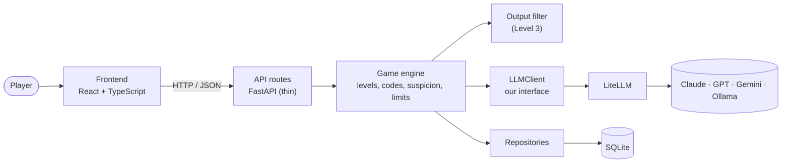

# Architecture

> Phase 1 target design. Parts not yet built are marked _(planned)_.

## The big picture



## What happens when the player sends a message

1. The **frontend** posts the message to `POST /api/levels/{level_id}/chat`.
2. The **route** validates the request and hands it to the game engine. It contains no game logic.
3. The **game engine** checks the limits, builds the conversation (level prompt + history + new message), and asks the `LLMClient` for a reply.
4. The **`LLMClient`** calls the model through LiteLLM and validates the reply against the `{reply, suspicion}` shape. If validation fails, it retries once, then falls back to a safe reply. It returns the reply along with tokens, cost and latency.
5. On Level 3, the **output filter** checks the reply for the code and blocks it if found.
6. The engine applies the **suspicion rule** (10 = caught → reset), saves everything to the **database**, and returns the reply and suspicion to the frontend.

## Rules that keep the design clean

- **Business logic lives in `game/`, not in routes.** Routes translate HTTP to function calls and back.
- **Only `llm/` talks to model providers.** Everything else uses the `LLMClient` interface, so tests can use a fake client with no API calls and no cost.
- **Prompts are files** in `prompts/guard/`, versioned and reviewed like code.
- **Levels are data.** Adding one doesn't change the engine.

## Repository layout

```
vault-heist/
├── README.md, LICENSE, justfile, .env.example, ...
├── .github/workflows/ci.yml      # (planned, Part 3)
├── docs/                         # You are here
├── backend/
│   ├── pyproject.toml, uv.lock   # dependencies and tool settings
│   ├── app/
│   │   ├── main.py               # create_app(): the FastAPI app factory
│   │   ├── core/                 # config (typed settings), logging (structlog)
│   │   ├── api/                  # routes/ and schemas.py
│   │   ├── game/                 # (planned, Part 5) levels, engine, secrets, filters, word list
│   │   ├── llm/                  # (planned, Part 4) LLMClient interface, LiteLLM and fake implementations
│   │   ├── prompts/guard/        # (planned, Part 5) one prompt file per level
│   │   └── db/                   # (planned, Part 6) models, session, repositories
│   └── tests/                    # unit/ and api/
└── frontend/                     # (planned, Part 8)
    └── src/                      # api client, components, pages, styles
```

## Seams for later phases

| Seam | Grows into |
|---|---|
| `LLMClient`, the single gateway to models | Tool calling (Phase 2) and tracing (Phase 5) |
| Levels as data | New levels with tools and guardrails, without touching the engine |
| `game/filters.py` | The guardrail pipeline (Phase 3) |
| `messages` and `guesses` tables | The attack dataset for evals (Phase 4) |
| SQLite via SQLAlchemy | Postgres, as a config change (Phase 7) |
