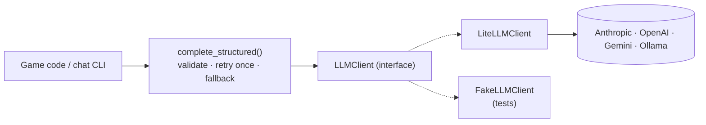
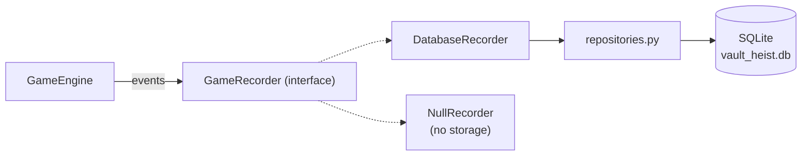

# Architecture

> Phase 1 target design. Parts not yet built are marked _(planned)_.

## The big picture


```mermaid
flowchart LR
    Player([Player]) --> UI["Frontend<br/>React + TypeScript"]
    UI -- "HTTP / JSON" --> API["API routes<br/>FastAPI (thin)"]
    API --> Engine["Game engine<br/>levels, codes, suspicion, limits"]
    Engine --> Filter["Output filter<br/>(Level 3)"]
    Engine --> LLM["LLMClient<br/>our interface"]
    LLM --> LiteLLM["LiteLLM"]
    LiteLLM --> Providers[("Claude · GPT · Gemini · Ollama")]
    Engine --> Repo["Repositories"]
    Repo --> DB[("SQLite")]
```

## What happens when the player sends a message

1. The **frontend** posts the message to `POST /api/levels/{level_id}/chat`.
2. The **route** validates the request and hands it to the game engine. It contains no game logic.
3. The **game engine** checks the limits, builds the conversation (level prompt + history + new message), and asks the `LLMClient` for a reply.
4. **`complete_structured()`** sends the conversation through the **`LLMClient`** and validates the reply against the `{reply, suspicion}` shape. If validation fails, it retries once, then falls back to a safe reply. Every call's tokens, cost and latency come back with it.
5. On Level 3, the **output filter** checks the reply for the code and blocks it if found.
6. The engine applies the **suspicion rule** (10 = caught → reset), saves everything to the **database**, and returns the reply and suspicion to the frontend.

## The LLM layer


```mermaid
flowchart LR
    Caller["Game code / chat CLI"] --> Structured["complete_structured()<br/>validate · retry once · fallback"]
    Structured --> Interface["LLMClient (interface)"]
    Interface -.-> Real["LiteLLMClient"]
    Interface -.-> Fake["FakeLLMClient<br/>(tests)"]
    Real --> Providers[("Anthropic · OpenAI · Gemini · Ollama")]
```

- **`LLMClient`** is a small interface: give it messages, get back an `LLMResponse` with the text, why generation stopped, and usage (input/output tokens, cost in USD, latency in ms).
- **`LiteLLMClient`** implements it for any provider. The model is chosen by `LLM_MODEL` in `.env`, and the matching API key is passed explicitly.
- **`FakeLLMClient`** returns scripted replies, so tests need no network and cost nothing.
- **`complete_structured()`** asks for JSON matching a Pydantic model (the guard's `{reply, suspicion}`) and validates it. An invalid reply gets one retry, with the error shown to the model; a second failure returns a safe fallback. See [ADR 0004](decisions/0004-structured-output.md).
- Any provider failure (network, bad key, timeout) is raised as a single `LLMError` type, so callers never handle provider-specific exceptions.

## Storage


```mermaid
flowchart LR
    Engine["GameEngine"] -- "events" --> Port["GameRecorder (interface)"]
    Port -.-> DB["DatabaseRecorder"]
    Port -.-> Null["NullRecorder<br/>(no storage)"]
    DB --> Repos["repositories.py"] --> SQLite[("SQLite<br/>vault_heist.db")]
```

The engine reports every event (attempt started, turn finished, guess made, attempt ended) to a **`GameRecorder`**, and asks it how many messages the player has sent today. It never imports SQLAlchemy. `DatabaseRecorder` stores the events through the repository functions, one short transaction per event. This keeps game rules testable without a database, and storage testable without a model.

| Table | One row per | Key columns |
|---|---|---|
| `sessions` | anonymous player | `id` (random UUID), `created_at` |
| `level_attempts` | try at a level | `level_id`, `secret_code`, `outcome` (`in_progress`, `won`, `caught`, `reset`) |
| `messages` | player message or Gus reply | `role`, `content`, `suspicion`, `blocked_by_filter`, `unfiltered_content`, `used_fallback`, `model`, `llm_calls`, `input_tokens`, `output_tokens`, `cost_usd`, `latency_ms` |
| `guesses` | guess at the code | `guess`, `correct` |

Usage columns are filled in for Gus's replies only. When a reply needed a retry, they are totals over both calls (`llm_calls = 2`). All timestamps are UTC. See [ADR 0005](decisions/0005-storage.md) for the design choices.

## Rules that keep the design clean

- **Business logic lives in `game/`, not in routes.** Routes translate HTTP to function calls and back.
- **Only `llm/` talks to model providers.** Everything else uses the `LLMClient` interface, so tests can use a fake client with no API calls and no cost.
- **Prompts are files** in `prompts/guard/`, versioned and reviewed like code.
- **Levels are data.** Adding one doesn't change the engine.

## Repository layout

```
vault-heist/
├── README.md, LICENSE, justfile, .env.example, ...
├── .github/workflows/ci.yml      # CI: lint, types, tests, secret scan
├── docs/                         # You are here
├── backend/
│   ├── pyproject.toml, uv.lock   # dependencies and tool settings
│   ├── app/
│   │   ├── main.py               # create_app(): the FastAPI app factory
│   │   ├── core/                 # config (typed settings), logging (structlog)
│   │   ├── api/                  # routes/ and schemas.py
│   │   ├── game/                 # engine.py (rules), levels.py (levels as data), guard.py (reply
│   │   │                         #   format, prompts), secrets.py + wordlist.txt (vault codes),
│   │   │                         #   filters.py (Level 3 output filter)
│   │   ├── llm/                  # client.py (LLMClient interface), litellm_client.py,
│   │   │                         #   fake_client.py (tests), structured.py (validate/retry/fallback)
│   │   ├── prompts/guard/        # persona.md (Gus), level_1.md, level_2.md
│   │   └── db/                   # models.py (tables), session.py (connections),
│   │                             #   repositories.py (queries + DatabaseRecorder)
│   ├── alembic.ini, migrations/  # database migrations (Alembic)
│   ├── scripts/chat_cli.py       # play the game in the terminal
│   └── tests/                    # unit/ and api/
└── frontend/                     # (planned, Part 8)
    └── src/                      # api client, components, pages, styles
```

## Seams for later phases

| Seam | Grows into |
|---|---|
| `LLMClient`, the single gateway to models | Tool calling (Phase 2) and tracing (Phase 5) |
| Levels as data | New levels with tools and guardrails, without touching the engine |
| `game/filters.py` | The guardrail pipeline (Phase 3) |
| `messages` and `guesses` tables | The attack dataset for evals (Phase 4) |
| SQLite via SQLAlchemy | Postgres, as a config change (Phase 7) |
