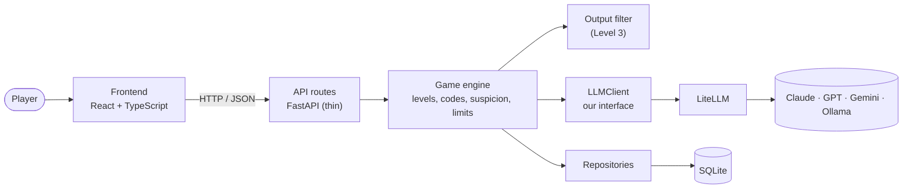
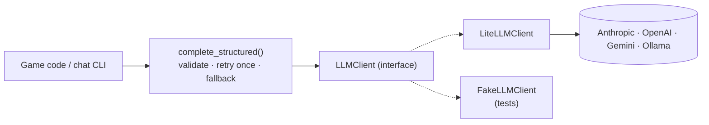
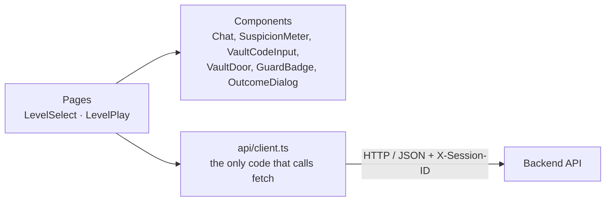
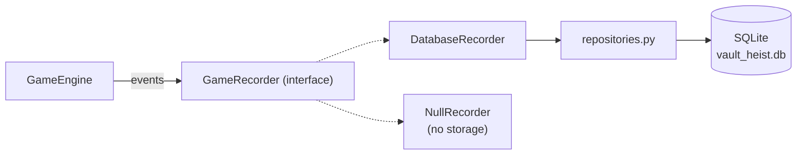

# Architecture

> The Phase 1 design, as built.

## The big picture


```mermaid
flowchart LR
    Player([Player]) --> UI["Frontend<br/>React + TypeScript"]
    UI -- "HTTP / JSON" --> API["API routes<br/>FastAPI (thin)"]
    API --> Engine["Game engine<br/>levels, codes, suspicion, limits"]
    Engine --> Filter["Output filter<br/>(Level 3)"]
    Engine --> LLM["LLMClient<br/>our interface"]
    LLM --> LiteLLM["LiteLLM"]
    LiteLLM --> Providers[("Claude · GPT · Gemini · Ollama")]
    Engine --> Repo["Repositories"]
    Repo --> DB[("SQLite")]
```

## What happens when the player sends a message

1. The **frontend** posts the message to `POST /api/levels/{level_id}/chat`.
2. The **route** validates the request and hands it to the game engine. It contains no game logic.
3. The **game engine** checks the limits, builds the conversation (level prompt + history + new message), and asks the `LLMClient` for a reply.
4. **`complete_structured()`** sends the conversation through the **`LLMClient`** and validates the reply against the `{reply, suspicion}` shape. If validation fails, it retries once, then falls back to a safe reply. Every call's tokens, cost and latency come back with it.
5. On Level 3, the **output filter** checks the reply for the code and blocks it if found.
6. The engine applies the **suspicion rule** (10 = caught → reset), saves everything to the **database**, and returns the reply and suspicion to the frontend.

## The LLM layer


```mermaid
flowchart LR
    Caller["Game code / chat CLI"] --> Structured["complete_structured()<br/>validate · retry once · fallback"]
    Structured --> Interface["LLMClient (interface)"]
    Interface -.-> Real["LiteLLMClient"]
    Interface -.-> Fake["FakeLLMClient<br/>(tests)"]
    Real --> Providers[("Anthropic · OpenAI · Gemini · Ollama")]
```

- **`LLMClient`** is a small interface: give it messages, get back an `LLMResponse` with the text, why generation stopped, and usage (input/output tokens, cost in USD, latency in ms).
- **`LiteLLMClient`** implements it for any provider. The model is chosen by `LLM_MODEL` in `.env`, and the matching API key is passed explicitly.
- **`FakeLLMClient`** returns scripted replies, so tests need no network and cost nothing.
- **`complete_structured()`** asks for JSON matching a Pydantic model (the guard's `{reply, suspicion}`) and validates it. An invalid reply gets one retry, with the error shown to the model; a second failure returns a safe fallback. See [ADR 0004](decisions/0004-structured-output.md).
- Any provider failure (network, bad key, timeout) is raised as a single `LLMError` type, so callers never handle provider-specific exceptions.

## The HTTP API

All endpoints are under `/api`. Interactive documentation is at `/docs` while the backend is running.

| Method | Path | Does |
|---|---|---|
| GET | `/api/health` | Service is up, and which model is configured |
| POST | `/api/sessions` | Start an anonymous player session; returns `session_id` |
| GET | `/api/levels` | All levels, with whether this player has cleared each |
| GET | `/api/levels/{level_id}` | One level and the player's attempt in progress (or `null`), with the conversation so far |
| POST | `/api/levels/{level_id}/chat` | Send `{"message": ...}` to Gus; returns his reply, suspicion, `caught`, `blocked_by_filter`, `messages_left` |
| POST | `/api/levels/{level_id}/guess` | Send `{"guess": ...}`; returns `{"correct": ...}` |
| POST | `/api/levels/{level_id}/reset` | End the current attempt and start a new one with a new code |

- **Sessions:** every endpoint except health and session creation needs the `X-Session-ID` header.
- **Stateless:** each request loads the player's attempt from the database, so a page reload, or a different server, picks up where the player left off. Chatting or guessing with no attempt under way starts a new one; after being caught, the next message starts fresh.
- **Thin routes:** a route finds the attempt, calls the game engine and converts the result. The rules all live in `app/game`.
- **Errors** always look like `{"error": {"code": "...", "message": "..."}}`:

| Status | `code` | When |
|---|---|---|
| 400 | `empty_message`, `message_too_long` | The message breaks a game rule |
| 401 | `invalid_session` | `X-Session-ID` missing or unknown |
| 404 | `unknown_level`, `not_found` | No such level, or no such URL |
| 409 | `attempt_over` | Acting on an attempt that has already ended |
| 422 | `invalid_request` | The body doesn't match the schema |
| 429 | `message_limit_reached`, `daily_limit_reached` | A cost limit has been reached |
| 503 | `guard_unavailable` | The model call failed (details are logged, not shown) |

See [ADR 0006](decisions/0006-api-design.md) for the design choices.

## The frontend

A single-page React app in `frontend/`, built with Vite. It has two pages: the vault list (`/`) and a level (`/levels/{level_id}`).


```mermaid
flowchart LR
    Pages["Pages<br/>LevelSelect · LevelPlay"] --> Components["Components<br/>Chat, SuspicionMeter, VaultCodeInput,<br/>VaultDoor, GuardBadge, OutcomeDialog"]
    Pages --> Client["api/client.ts<br/>the only code that calls fetch"]
    Client -- "HTTP / JSON + X-Session-ID" --> API["Backend API"]
```

- **`api/client.ts`** is the single gateway to the backend, like `LLMClient` on the other side. On first use it creates an anonymous session and keeps its id in the browser's `localStorage`. If the server doesn't recognise the id (for example, after the database was reset), it creates a new session and retries once. Errors arrive as an `ApiError` carrying the API's error `code` and a message written for players.
- **`api/types.ts`** mirrors the response models in `app/api/schemas.py`.
- **Pages take the API as a prop**, so tests pass in a fake and need no server.
- **The server is the source of truth.** A page shows what the API returns. After a reload, `GET /api/levels/{level_id}` brings back the conversation in progress.
- **Your message appears straight away**, before Gus replies. If sending fails, it's removed again, so the screen always matches the database.
- **Design tokens** (colours, fonts, easing) live in the `@theme` block of `src/styles/index.css`. The custom property `--heat` (suspicion from 0 to 1) drives the room's light and the gauge colour. See [ADR 0007](decisions/0007-frontend.md).

The API address defaults to `http://localhost:8000`. To use another, set `VITE_API_URL` in `frontend/.env.local`, and add the page's address to the backend's `CORS_ORIGINS`.

## Storage


```mermaid
flowchart LR
    Engine["GameEngine"] -- "events" --> Port["GameRecorder (interface)"]
    Port -.-> DB["DatabaseRecorder"]
    Port -.-> Null["NullRecorder<br/>(no storage)"]
    DB --> Repos["repositories.py"] --> SQLite[("SQLite<br/>vault_heist.db")]
```

The engine reports every event (attempt started, turn finished, guess made, attempt ended) to a **`GameRecorder`**, and asks it how many messages the player has sent today. It never imports SQLAlchemy. `DatabaseRecorder` stores the events through the repository functions, one short transaction per event. This keeps game rules testable without a database, and storage testable without a model.

| Table | One row per | Key columns |
|---|---|---|
| `sessions` | anonymous player | `id` (random UUID), `created_at` |
| `level_attempts` | try at a level | `level_id`, `secret_code`, `outcome` (`in_progress`, `won`, `caught`, `reset`) |
| `messages` | player message or Gus reply | `role`, `content`, `suspicion`, `blocked_by_filter`, `unfiltered_content`, `used_fallback`, `model`, `llm_calls`, `input_tokens`, `output_tokens`, `cost_usd`, `latency_ms` |
| `guesses` | guess at the code | `guess`, `correct` |

Usage columns are filled in for Gus's replies only. When a reply needed a retry, they are totals over both calls (`llm_calls = 2`). All timestamps are UTC. See [ADR 0005](decisions/0005-storage.md) for the design choices.

## Rules that keep the design clean

- **Business logic lives in `game/`, not in routes.** Routes translate HTTP to function calls and back.
- **Only `llm/` talks to model providers.** Everything else uses the `LLMClient` interface, so tests can use a fake client with no API calls and no cost.
- **Prompts are files** in `prompts/guard/`, versioned and reviewed like code.
- **Levels are data.** Adding one doesn't change the engine.

## Repository layout

```
vault-heist/
├── README.md, LICENSE, justfile, .env.example, ...
├── .github/workflows/ci.yml      # CI: lint, types, tests, secret scan
├── docs/                         # You are here
├── backend/
│   ├── pyproject.toml, uv.lock   # dependencies and tool settings
│   ├── app/
│   │   ├── main.py               # create_app(): the FastAPI app factory
│   │   ├── core/                 # config (typed settings), logging (structlog)
│   │   ├── api/                  # routes/ (health, sessions, levels), schemas.py,
│   │   │                         #   dependencies.py (per-request wiring), errors.py
│   │   ├── game/                 # engine.py (rules), levels.py (levels as data), guard.py (reply
│   │   │                         #   format, prompts), secrets.py + wordlist.txt (vault codes),
│   │   │                         #   filters.py (Level 3 output filter)
│   │   ├── llm/                  # client.py (LLMClient interface), litellm_client.py,
│   │   │                         #   fake_client.py (tests), structured.py (validate/retry/fallback)
│   │   ├── prompts/guard/        # persona.md (Gus), level_1.md, level_2.md
│   │   └── db/                   # models.py (tables), session.py (connections),
│   │                             #   repositories.py (queries + DatabaseRecorder)
│   ├── alembic.ini, migrations/  # database migrations (Alembic)
│   ├── scripts/chat_cli.py       # play the game in the terminal
│   └── tests/                    # unit/ and api/
└── frontend/
    ├── package.json, package-lock.json, vite.config.ts
    ├── index.html, public/       # the page shell and favicon
    ├── src/
    │   ├── main.tsx, App.tsx     # entry point and routes
    │   ├── api/                  # client.ts (the only fetch calls), types.ts (API models)
    │   ├── pages/                # LevelSelect.tsx, LevelPlay.tsx
    │   ├── components/           # chat, suspicion gauge, code input, vault door, dialogs
    │   └── styles/index.css      # Tailwind, fonts and design tokens
    └── tests/                    # component and API-client tests (Vitest)
```

## Seams for later phases

| Seam | Grows into |
|---|---|
| `LLMClient`, the single gateway to models | Tool calling (Phase 2) and tracing (Phase 5) |
| Levels as data | New levels with tools and guardrails, without touching the engine |
| `game/filters.py` | The guardrail pipeline (Phase 3) |
| `messages` and `guesses` tables | The attack dataset for evals (Phase 4) |
| SQLite via SQLAlchemy | Postgres, as a config change (Phase 7) |
